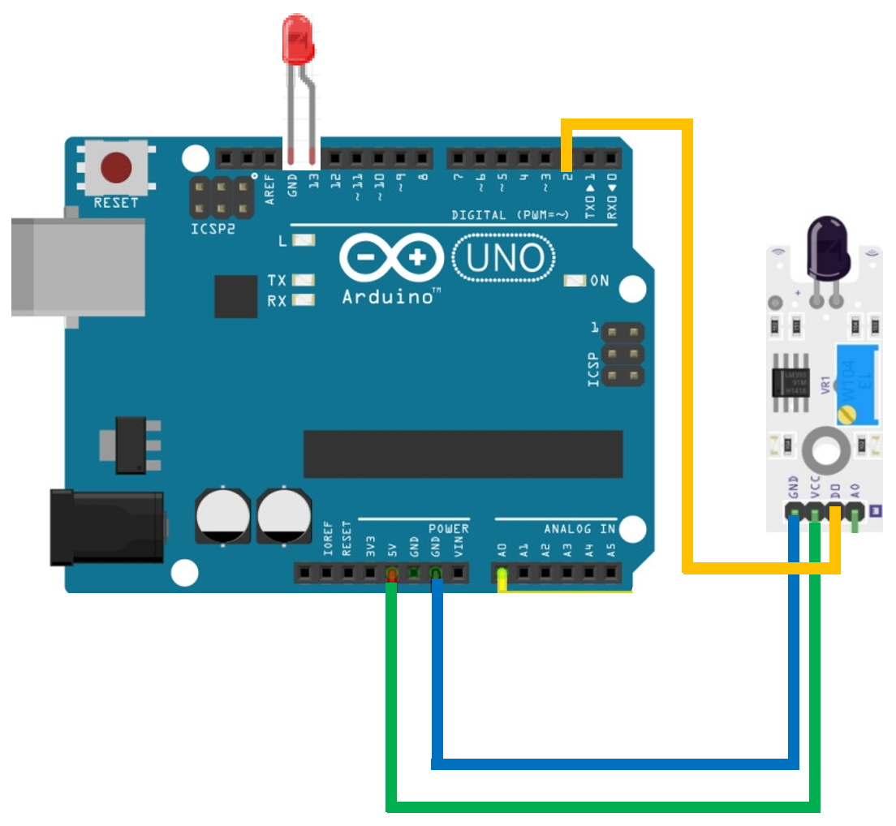
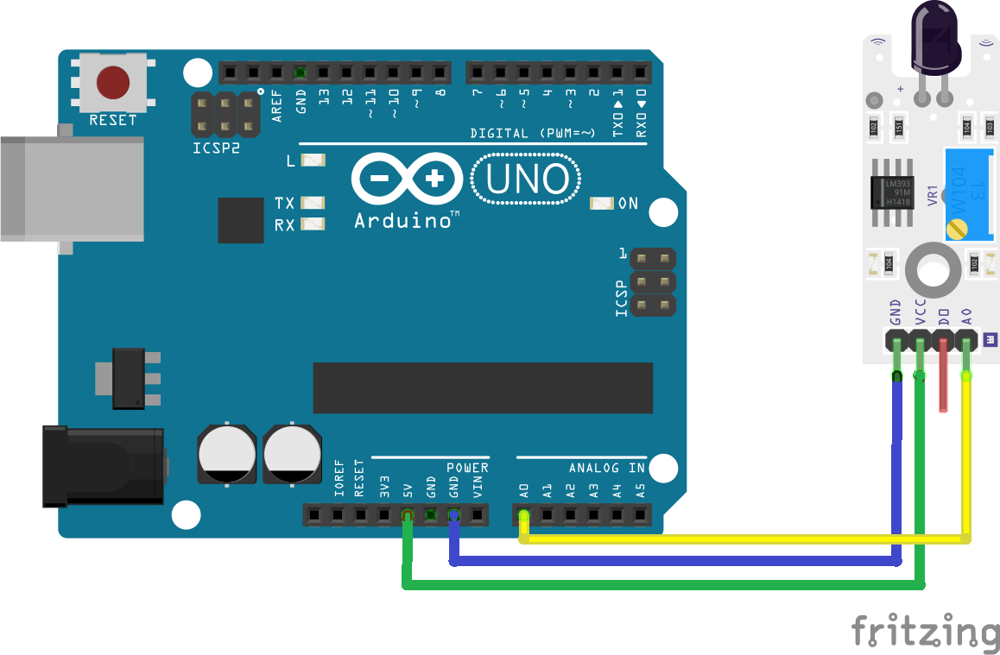

# WPSE352 photosensitive sensor module

## Example 1
This example shows how you can use the Whadda WPSE352 photosensitive sensor module with an Arduino® compatible board.
The example program reads the digital light signal value from the ```D0``` pin on the module and turns on an led.

### Library dependencies
* None

### Wiring diagram


## Example 2
This example shows how you can use the Whadda WPSE352 photosensitive sensor module with an Arduino® compatible board.
The example program reads the digital light signal value from the ```A0``` pin on the module and prints the result in the serial monitor.

### Library dependencies
* None

### Wiring diagram


## Additional information
  For more information about the Whadda WPSE352 photosensitive sensor module, check the manual available at [whadda.com](https://whadda.com)

